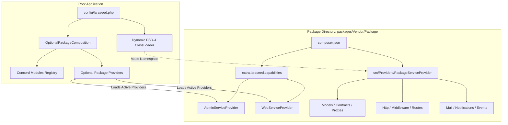

# Laraseed Package Generator V4 — Architecture & Internal Design

This document details the architectural principles, concurrency controls, discovery mechanisms, and security invariants implemented in Laraseed Package Generator V4.

---

## 1. Architectural Philosophy & Isolation

Laraseed Package Generator V4 is architected around strict encapsulation:
1. **Zero Core Pollution:** Code generated for optional packages lives entirely within `packages/{Vendor}/{Package}`. Host application core and foundation services are never directly mutated.
2. **Contract-First Extensibility:** Domain models leverage Concord contracts and proxies (`Contract`, `Proxy`), allowing downstream packages or host applications to override model implementations without altering package internals.
3. **Decoupled Presentation Capabilities:** Domain packages can exist with zero presentation logic. Admin (`src/Admin/`) and Web (`src/Web/`) capabilities are scaffolded as independently activatable sub-modules recorded in `composer.json`.



---

## 2. Dual Package Architecture: Concord vs Plain

Laraseed V4 provides two distinct package modalities:

### 2.1 Concord Modular Packages (Default)
- **Target Use Case:** Full-featured modular extensions, business domains, entities, and presentation modules.
- **Scaffolding:** Includes `src/Providers/PackageServiceProvider.php` (extending `Konekt\Concord\BaseModuleServiceProvider`), `composer.json` with Concord extra metadata (`"type": "optional"`), and dedicated directories for models, migrations, repositories, and routes.

### 2.2 Plain PSR-4 Libraries (`--plain`)
- **Target Use Case:** Lightweight standalone PHP libraries, algorithmic helpers, SDKs, or standalone services.
- **Scaffolding:** Minimalist `composer.json` without Concord dependencies, clean `src/` directory, and a standard `Illuminate\Support\ServiceProvider`.

---

## 3. Filesystem Transactions & Concurrency Safety

### 3.1 Transactional Operations (`FilesystemTransaction`)
To guarantee that generation operations are atomic and never leave corrupt or partial files on disk:
- [`GenerationPlan`](../src/Generators/GenerationPlan.php) compiles all target paths and planned contents.
- [`GenerationPlan::preflight()`](../src/Generators/GenerationPlan.php) detects collisions prior to any disk mutation.
- [`FilesystemTransaction`](../src/Generators/FilesystemTransaction.php) executes the plan. If any error occurs mid-stream, the transaction:
  1. Deletes all newly created files and directories.
  2. Restores all modified files (e.g. `composer.json`) to their exact original pre-transaction byte contents.

### 3.2 Cross-Process Concurrency Locking (`PackageLock`)
When multiple processes attempt to generate components or capabilities on the same package simultaneously (e.g. concurrent execution of `make-admin` and `make-web` in CI/CD or build pipelines):
- [`PackageLock`](../src/Support/PackageLock.php) creates an advisory filesystem lock (`flock`) keyed by the canonical realpath of the target package.
- Lock files are stored under `storage/framework/locks/laraseed_pkg_{hash}.lock` and record PID and timestamp metadata.
- **Reentrant Support:** Nested lock requests from the same PHP process succeed without deadlocking.
- **Cross-Process Exclusion:** Concurrent processes wait up to a configurable timeout (default 5.0s) for the active transaction to finish before proceeding, guaranteeing zero lost updates to `composer.json`.

---

## 4. Package Discovery & Runtime PSR-4 Mapping

In Laravel 11 and 12, newly generated path packages are not indexed in Composer's static `autoload_psr4.php` until `composer dump-autoload` is executed.

To prevent bootstrap crashes (Catch-22 deadlocks where Artisan cannot run to manage packages), the configuration loader implements a dynamic classloading bridge:
1. Locates the active `Composer\Autoload\ClassLoader` from `spl_autoload_functions()`.
2. Discovers local `packages/*/*/composer.json` manifests.
3. Validates path containment (ensuring source paths reside strictly within `packages/`).
4. Dynamically registers the package's PSR-4 namespace prefix using `$composerLoader->addPsr4($prefix, $targetSrc)`.
5. **Partitioned Validation:**
   - **Active Packages:** Packages declared in `LARASEED_OPTIONAL_PACKAGES` are strictly loaded through `OptionalPackageManifestLoader`, raising descriptive diagnostic errors if required provider classes are missing.
   - **Inactive Packages:** Inactive packages on disk are checked with `class_exists()` and skipped if unresolvable, guaranteeing that broken dormant packages never halt host application bootstrap.

---

## 5. Security & Boundary Hardening

| Layer | Security Mechanism | Invariant Enforced |
| :--- | :--- | :--- |
| **Path Traversal** | [`PathGuard`](../src/Support/PathGuard.php) | Rejects path escapes (`../`, `..\`, null bytes) in package names, class identifiers, template paths, and output targets. |
| **Symlink Containment** | Canonical Realpath Validation | Resolves canonical target paths via `realpath()`; targets pointing outside `packages/` are discarded. |
| **CSP Compliance** | Strict Blade Template Auditing | Web capability stubs contain zero inline JavaScript handlers (`onclick`), unescaped variable injections, or unsafe CSS sinks. |
| **Template Source Trust** | Dynamic Template Catalog | Custom templates registered via `WebTemplateCatalog` must specify trusted source paths residing within authorized package roots or application stubs. |

---

## 6. Core Web Entry Point & Root-Mounted Default Web Package

Laraseed includes a production-grade modular web routing architecture:

### 6.1 Root-Mounted Default Web Package
When an administrator selects a default Web package via `LARASEED_DEFAULT_WEB_PACKAGE=pkg` (or `config('laraseed.default_web_package')`):
1. **Direct Root Mount (Zero Redirects):** The package's generated `WebServiceProvider` detects default package status at boot time and configures its prefix as `''`.
2. **Direct Homepage:** `GET /` directly serves the default package's homepage (`HomeController::index`) returning HTTP 200 with zero redirects.
3. **Root-Based Internal URLs:** Internal pages (e.g. `/pages/about`, `/pages/contact`, `/branding.css`, `/account/dashboard`) are served directly under root without exposing package slugs in the URL path.
4. **Root Owner Claim:** The default package claims root route ownership by setting `config(['laraseed.web.root_owner' => '{packageKey}'])`.
5. **Fallback Coordination:** `routes/web.php` checks `config('laraseed.web.root_owner')` and registers `App\Http\Controllers\WebEntryPointController` only when no package has claimed root.

### 6.2 Isolated Prefixes for Non-Default Packages
Optional Web packages that are not configured as the default retain their isolated slug prefix (e.g. `/store-pkg`, `/store-pkg/pages/about`), allowing multiple Web capabilities to coexist securely.

### 6.3 Empty Application & Fallback Mode
When zero optional Web packages are enabled or when no default package is selected:
- `config('laraseed.web.root_owner')` remains `null`.
- `WebEntryPointController` registers at `GET /` and renders `resources/views/web/fallback.blade.php` with HTTP 200 OK.

### 6.4 Collision Detection & Protected Route Invariants
- **Multiple Root Claims:** If a second package attempts to mount at root (`''`), `WebServiceProvider` throws a `RuntimeException` preventing silent route shadowing.
- **Reserved System Prefixes:** Packages attempting to use reserved core prefixes (`admin`, `install`, `api`, `up`, `sanctum`) are rejected at boot time with a descriptive `RuntimeException`.
- **Admin Isolation:** Core administration (`/admin`, `/admin/login`) and redirect handlers are permanently protected and never intercepted by root-mounted web packages.

### 6.5 Production Cache Consistency
Because root mounting dynamically determines route prefixes during route compilation, updating `LARASEED_DEFAULT_WEB_PACKAGE` in production requires running:
```bash
php artisan config:cache && php artisan route:cache
```

### 6.6 Dynamic Classloading Under Configuration Cache
When `php artisan config:cache` is executed, Laravel bypasses runtime execution of `config/*.php` and `bootstrap/providers.php`. To ensure all local optional packages (`packages/*/*`) remain resolvable without requiring manual `composer dump-autoload` executions across caching transitions, a dynamic PSR-4 classloader registration bridge is embedded in `bootstrap/app.php`. This guarantees consistent autoloading in both development and production environments.
