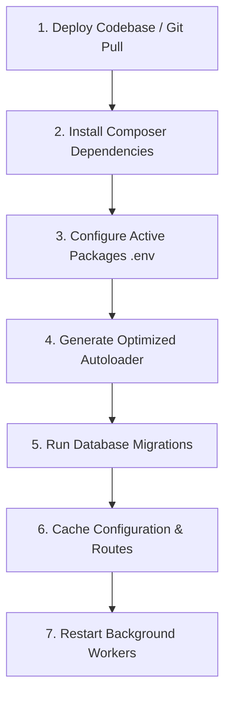

# Laraseed Package Generator V4 — Production Deployment Guide

This guide outlines the recommended deployment procedures, configuration caching, Composer autoload optimization, and operational guidelines for deploying Laraseed applications and optional packages in staging and production environments.

---

## 1. Deployment Lifecycle Workflow

Follow this sequence when deploying updates that include optional packages:



### Step-by-Step Deployment Commands

```bash
# 1. Update project files
git pull origin main

# 2. Install production dependencies without dev packages
composer install --no-dev --optimize-autoloader --no-interaction

# 3. Ensure environment variables are set for active optional packages
# (e.g. in .env: LARASEED_OPTIONAL_PACKAGES="billing,store")

# 4. Rebuild optimized Composer autoloader
composer dump-autoload --optimize

# 5. Execute pending database migrations for core and active packages
php artisan migrate --force

# 6. Cache Laravel configurations and routes
php artisan config:cache
php artisan route:cache
php artisan view:cache

# 7. Restart background queues
php artisan queue:restart
```

---

## 2. Composer Autoloading Modes & Path Packages

### 2.1 Optimized Autoloading (`composer dump-autoload -o`)
- **Recommended for Production:** `composer dump-autoload -o` converts all PSR-4 rules into a static classmap while retaining dynamic fallbacks.
- **Compatibility:** Fully compatible with Laraseed's dynamic ClassLoader integration in `config/laraseed.php`.

### 2.2 Authoritative Classmap Mode (`composer dump-autoload -a` / `--classmap-authoritative`)
- **Behavior:** In authoritative mode, Composer sets `ClassLoader::$classMapAuthoritative = true`. Composer will strictly look up classes in `autoload_classmap.php` and **will not perform filesystem scans on disk** for missing classes.
- **Operational Requirement:** If authoritative mode is used in production, `composer dump-autoload -a` **must be executed after all package files are placed on disk**. Generating or copying new package source files without re-running `composer dump-autoload` will result in class resolution failures because Composer deliberately bypasses disk scanning.

---

## 3. Package Activation Configuration

Optional packages are enabled using the `LARASEED_OPTIONAL_PACKAGES` environment variable.

### Format
A comma-separated list of package IDs (derived from `extra.laraseed.id` in `composer.json` or snake_case of package name):

```dotenv
# Single package
LARASEED_OPTIONAL_PACKAGES="billing"

# Multiple packages
LARASEED_OPTIONAL_PACKAGES="billing,helpdesk,store"

# All optional packages disabled
LARASEED_OPTIONAL_PACKAGES=""
```

### Verification
Inspect the loaded composition and status using the read-only inspection command:
```bash
php artisan laraseed:packages
```

### 3.2 Web Package Lifecycle & Default Selection
To manage the complete lifecycle of Web-capable packages:

#### 1. Generating a Web Package
```bash
php artisan laraseed:make-package Acme/Store
php artisan laraseed:make-web Acme/Store
```
*Note: Generating a package creates its skeleton but does NOT activate or select it.*

#### 2. Activating the Package
Add the package identifier to `LARASEED_OPTIONAL_PACKAGES` in `.env`:
```dotenv
LARASEED_OPTIONAL_PACKAGES="store"
```

#### 3. Selecting as Default Public Web Package
```bash
php artisan laraseed:web-default store
```
This validates eligibility and atomically sets `LARASEED_DEFAULT_WEB_PACKAGE="store"` in `.env`.

#### 4. Switching the Default Package
```bash
# Switch seamlessly to another enabled package
php artisan laraseed:web-default portal
```

#### 5. Clearing Default Selection
```bash
# Revert root / to built-in fallback landing view
php artisan laraseed:web-default --clear
```

#### 6. Production Cache Rebuilding Checklist
After activating, deactivating, or switching default Web packages in production:
```bash
# 1. Regenerate optimized Composer classmap
composer dump-autoload --optimize

# 2. Rebuild configuration & route caches
php artisan config:cache
php artisan route:cache

# 3. Restart queue workers (if mail/notifications were updated)
php artisan queue:restart
```

---

## 4. Filesystem Permissions & Lock Storage

Laraseed Package Generator uses advisory file locks during generation and atomic capability updates.

Ensure the following directories have read/write permissions for the web server and CLI users:
- `storage/framework/locks/` — Directory used by [`PackageLock`](../src/Support/PackageLock.php).
- `storage/framework/cache/`
- `storage/logs/`
- `packages/` (in development or build worker environments where generator commands execute).

---

## 5. Queue, Mail & Broadcast Configuration

When deploying packages that utilize V4 messaging components:

### 5.1 Queued Mailables & Notifications
If packages utilize `--queued` mailables or notifications, ensure background queue workers are configured:
```bash
# In production (via Supervisor / Systemd)
php artisan queue:work --sleep=3 --tries=3 --max-time=3600
```

### 5.2 Broadcast Notifications
If packages utilize `--broadcast` notifications:
- Configure broadcast connection in `config/broadcasting.php` (`reverb`, `pusher`, etc.).
- Ensure broadcasting credentials (`REVERB_APP_KEY`, etc.) are configured in `.env`.

---

## 6. Rollback & Recovery Procedures

### 6.1 Disabling a Problematic Package
If a package encounters a runtime issue in production:
1. Remove its identifier from `LARASEED_OPTIONAL_PACKAGES` in `.env`:
   ```dotenv
   LARASEED_OPTIONAL_PACKAGES="billing" # Removed broken package
   ```
2. Clear and rebuild configuration cache:
   ```bash
   php artisan config:cache
   php artisan route:cache
   ```
3. The package's service providers, routes, and Concord modules will be immediately deactivated without requiring code deletion or database drops.

### 6.2 Generator Transaction Failures
If a generator command fails mid-operation (e.g. disk space exhaustion), [`FilesystemTransaction`](../src/Generators/FilesystemTransaction.php) automatically rolls back created files. Check `storage/logs/laravel.log` for full exception stack traces.
