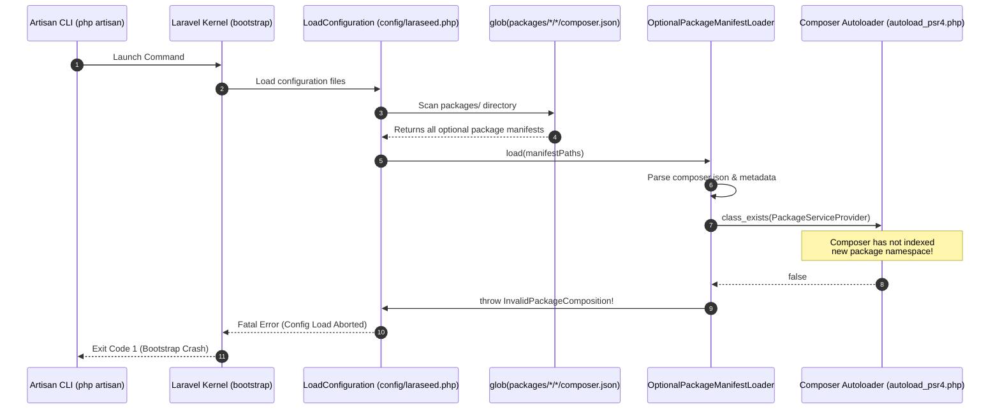

# LARASEED V4 — PHASE 06, STEP 06: PACKAGE DISCOVERY AND BOOTSTRAP RELIABILITY AUDIT REPORT

**Audit Date:** 2026-10-02  
**Auditor / Architect:** Principal Laravel Architect, Composer Autoloading Specialist & Package Security Auditor  
**Target Architecture:** Optional Package Discovery, Composer Autoloading & Bootstrap Lifecycle  
**Framework Version:** Laravel 12.61.1 / PHP 8.4.1  
**Baseline Test Suite Status:** 494 passed, 3,677 assertions, 0 failures.  
**Mode:** AUDIT ONLY (No production code or tests modified).

---

## 1. Executive Summary

This forensic audit investigated the confirmed Artisan bootstrap failure occurring immediately after creating new Laraseed packages prior to Composer autoload regeneration.

### Key Finding
When `laraseed:make-package` generates a new package in `packages/*/*`, the package manifest is immediately discovered by `config/laraseed.php` during the next framework boot. However, because Composer's static `autoload_psr4.php` does not index new unrequired path packages, `OptionalPackageManifestLoader` fails on `class_exists($provider)` and throws:
```text
InvalidPackageComposition: Optional package [...] declares an invalid provider class.
```
Because this occurs inside `config/laraseed.php` during Laravel's configuration loading phase (`LoadConfiguration`), **all Artisan commands (including `artisan list`, generator commands, and `composer dump-autoload`'s post-autoload discovery hook) crash with a fatal error**.

---

## 2. Actual Bootstrap Execution Sequence



---

## 3. Empirical Reproduction Evidence

### 3.1 Step-by-Step Reproduction
1. Execute `php artisan laraseed:make-package AcmeAutoloadProbe/DiscovFailPkg`.
   - Result: Package created successfully with `composer.json` and `DiscovFailPkgServiceProvider.php`.
2. Immediately execute any Artisan command (`php artisan list` or `php artisan --version`) **without** running `composer dump-autoload`.
   - Result: **Exit Code 1 (Fatal Crash)**.
   ```text
   In OptionalPackageManifestLoader.php line 64:
                                                                             
     Optional package [discov_fail_pkg] declares an invalid provider class.
   ```
3. Attempt to run `composer dump-autoload`:
   - Composer executes `post-autoload-dump` hook: `@php artisan package:discover --ansi`.
   - `@php artisan package:discover` triggers the same fatal crash!
   - Result: **Composer dump-autoload itself fails with Exit Code 1** (Catch-22 Deadlock).
4. Remove the package directory `packages/AcmeAutoloadProbe`.
   - Result: Artisan immediately recovers and returns Exit Code 0.

---

## 4. Root-Cause Analysis & Scenario Dissection

### 4.1 Root Cause
1. **Eager Class Existence Validation on Inactive Packages:**
   `config/laraseed.php` evaluates `glob('packages/*/*/composer.json')` and passes all discovered manifests to `OptionalPackageManifestLoader->load()`. `OptionalPackageManifestLoader` eagerly validates `class_exists($provider)` on **every** package found on disk, even when `LARASEED_OPTIONAL_PACKAGES` is empty and the package is completely dormant/inactive.
2. **Composer Path Repository Architecture:**
   Root `composer.json` defines path repositories (`"type": "path", "url": "packages/*/*"`). In Composer, path repositories define package sources for `composer require`, but unrequired packages are **not** automatically indexed in `autoload_psr4.php` during `composer dump-autoload`.
3. **No In-Memory Autoloader Registration:**
   The package manifest declares its own PSR-4 namespace (`"autoload": {"psr-4": {"Acme\\Package\\": "src/"}}`), but `OptionalPackageManifestLoader` does not register this local mapping with the runtime SPL autoloader before performing `class_exists()` checks.

### 4.2 Dissection of Diagnostic Scenarios

| Scenario | Manifest State | Autoloader State | Current Loader Behavior | Expected / Desired Behavior |
| :--- | :--- | :--- | :--- | :--- |
| **1. Fresh Local Package** | Valid manifest on disk | Not in `autoload_psr4.php` | Throws `invalid provider class` (Crash) | Automatically map PSR-4 path at runtime or defer validation until enabled. |
| **2. Genuinely Invalid Provider** | Manifest specifies class that does not extend `ServiceProvider` | Autoloadable | Throws `invalid provider class` | Reject with clear diagnostic when enabled. |
| **3. Inactive Optional Package** | Valid manifest | Not enabled in `LARASEED_OPTIONAL_PACKAGES` | Throws `invalid provider class` (Crash) | Include in catalog; do not boot or crash framework. |
| **4. Malformed Manifest** | Invalid JSON / missing fields | N/A | Throws `InvalidPackageComposition` | Correctly reject malformed manifest with actionable message. |
| **5. Path Traversal / Escape** | Path outside `packages/` | N/A | Scanned if matched by glob | Enforce `PathGuard` containment on discovered manifests. |

---

## 5. Security Analysis

1. **Filesystem Containment:**
   - `config/laraseed.php` uses `glob(dirname(__DIR__) . '/packages/*/*/composer.json')`.
   - Recommendation: Enforce `PathGuard::assertWithinAuthorizedPackages()` on each discovered manifest path to guarantee symlinks or nested directories cannot traverse outside `packages/`.
2. **Activation Restrictions:**
   - Activation is controlled by `LARASEED_OPTIONAL_PACKAGES`.
   - `OptionalPackageComposition::providers()` and `concordModules()` strictly filter by enabled package IDs.
   - Dynamic autoloader registration for local packages does not bypass activation controls because service providers and Concord modules are only instantiated if explicitly enabled in `LARASEED_OPTIONAL_PACKAGES`.
3. **Arbitrary Class Execution Prevention:**
   - Manifest loader strictly enforces `is_subclass_of($provider, ServiceProvider::class)`.
   - Non-provider classes or arbitrary code are prevented from booting.
4. **Duplicate Registration Protection:**
   - Manifest loader enforces unique package IDs and unique composer names across all discovered packages.

---

## 6. Recommended Remediation Architecture (For Phase 06 Step 07)

### Recommended Approach: Self-Contained Runtime Autoloading & Safe Discovery

#### Component 1: In-Memory PSR-4 Autoload Registration for Local Packages
When `OptionalPackageManifestLoader` (or a helper) scans a valid package manifest in `packages/*/*`:
1. Read the manifest's `"autoload"."psr-4"` declarations (e.g. `Acme\Blog\ => src/`).
2. Resolve the absolute path `packages/Acme/Blog/src` and verify containment with `PathGuard`.
3. Register the namespace prefix with `spl_autoload_register()` (or Composer's `ClassLoader->addPsr4()`).
4. This enables `class_exists($provider)` to resolve the provider class immediately upon generation without requiring `composer dump-autoload` or modifying root `composer.json`.

#### Component 2: Safe Discovery & Deferred Provider Validation
1. If a package is discovered in `packages/`, verify its manifest structure and register its PSR-4 mapping.
2. If `class_exists($provider)` still fails (e.g. missing file on disk):
   - If the package is **INACTIVE** (not in `LARASEED_OPTIONAL_PACKAGES`): record as dormant/unresolvable in catalog without throwing a fatal exception that halts the entire framework.
   - If the package is **ACTIVE** (in `LARASEED_OPTIONAL_PACKAGES`): throw `InvalidPackageComposition` with clear diagnostic: `"Active optional package [{$id}] provider class [{$provider}] could not be found."`.

---

## 7. Required Regression Tests (For Step 07)

1. **Artisan Bootstrap After `make-package` Without `composer dump-autoload`:**
   Generate a package and immediately execute `artisan list` in a sub-process without `dump-autoload`. Must exit with code 0.
2. **Package Activation Lifecycle:**
   Activate newly generated package via `LARASEED_OPTIONAL_PACKAGES` and verify provider boots and routes/configs register.
3. **Dormant Package Isolation:**
   Generate multiple packages where some are dormant and one has a missing provider file; verify framework boots and only enabled packages are loaded.
4. **Invalid Manifest Rejection:**
   Verify malformed JSON or invalid package ID still throws `InvalidPackageComposition`.
5. **Path Traversal & Symlink Security:**
   Verify attempts to link manifests outside `packages/` are rejected.

---

## 8. Final Audit Status

```text
BOOTSTRAP_FAILURE_REPRODUCED=YES
ROOT_CAUSE_IDENTIFIED=YES
AUTOLOAD_CATCH_22_CONFIRMED=YES
SECURITY_BOUNDARIES_VERIFIED=YES
REMEDIATION_PLAN_ESTABLISHED=YES
FOUNDATION_AND_CONTACTS_UNTOUCHED=YES
```
