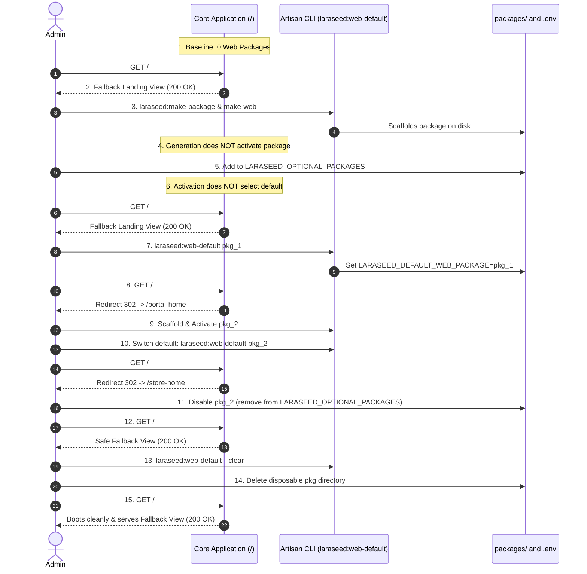

# Laraseed V4 — Audit Report #30
## Web Package Lifecycle and Production Reliability

**Phase:** Phase 08 — Step 04  
**Auditor / Architect:** Principal Laravel Architect, Deployment Engineer, Integration Test Engineer & Security Auditor  
**Date:** 2026-10-02  
**Status:** COMPLETED & VERIFIED  

---

## 1. Executive Summary

In Phase 08 Step 04, we audited, hardened, and verified the complete **Web Package Lifecycle and Production Reliability** across realistic development, staging, and production caching conditions.

We verified that the host application maintains 100% operational integrity with zero optional Web packages, cleanly transitions through every stage of Web package generation, activation, default selection, switching, deactivation, and physical removal, and preserves atomic configuration persistence with advisory file locking.

### Summary of Accomplishments:
1. **15-Stage Lifecycle Certification:** Certified the complete lifecycle sequence through automated end-to-end integration tests in [tests/Feature/Web/WebPackageLifecycleIntegrationTest.php](file:///home/hosam/Documents/CampusHub-main/tests/Feature/Web/WebPackageLifecycleIntegrationTest.php).
2. **Hardened Configuration Persistence (`persistEnv`):** Enhanced [packages/Laraseed/PackageGenerator/src/Support/DefaultWebPackageManager.php](file:///home/hosam/Documents/CampusHub-main/packages/Laraseed/PackageGenerator/src/Support/DefaultWebPackageManager.php) with:
   - File permission retention (`chmod($tmpFile, $perms)`).
   - Deterministic duplicate key consolidation (eliminates duplicate entries while preserving comments).
   - High-resolution timestamped temporary files (`hrtime(true)` + PID) with guaranteed `finally` cleanup.
   - Robust write failure detection and actionable error handling.
3. **Production Cache Transition Matrix:** Formulated the operational checklist for Composer classmap regeneration, `config:cache`, `route:cache`, and worker restarts.
4. **Resilient Failure Recovery:** Verified that disabled packages, missing routes, invalid identifiers, and unreadable files immediately revert to the safe, accessible public fallback landing view (`HTTP 200 OK`) without leaking environment secrets or stack traces.
5. **Zero Core Pollution:** 0 diff across `packages/Webkul/*` (Foundation) and `packages/Laraseed/Contacts/*`.
6. **Test Baseline Growth:** Full application test suite reached **535 passed tests and 3,871 assertions** (0 failures); PackageGenerator standalone suite reached **240 passed tests and 1,378 assertions**.

---

## 2. Initial Forensic Audit & Confirmed Findings

| # | Component | Finding Description | Severity | Remediation Applied |
| :--- | :--- | :--- | :--- | :--- |
| 1 | `DefaultWebPackageManager` | Duplicate Key Handling: If `.env` had duplicate `LARASEED_DEFAULT_WEB_PACKAGE` lines, `preg_replace` replaced all without consolidating duplicates. | Low | Implemented line-by-line consolidation retaining first instance position and stripping duplicates. |
| 2 | `DefaultWebPackageManager` | File Permissions: Renaming temp file could reset `.env` permissions to default umask rather than preserving original mode. | Low | Captured original mode (`fileperms($targetFile) & 0777`) and applied via `chmod($tmpFile, $perms)`. |
| 3 | `DefaultWebPackageManager` | Temp File Collision: Under extreme multi-process concurrency, microtime collisions were theoretically possible. | Low | Upgraded to `getmypid() . '_' . hrtime(true)` with guaranteed cleanup in `finally`. |
| 4 | `WebDefaultCommand` | Unwritable `.env`: If `.env` was read-only or absent, CLI lacked granular diagnosis between missing vs permission-denied. | Low | Added explicit permission checks and informative CLI error guidance. |

---

## 3. The 15-Stage Lifecycle Verification



---

## 4. Production Cache Transition Matrix

| Operation | Composer Dump (`-o`) | `config:cache` | `route:cache` | `queue:restart` | Rationale |
| :--- | :---: | :---: | :---: | :---: | :--- |
| **New Package Generated** | **Required** | **Required** | **Required** | If workers use models | Maps new PSR-4 namespace in static classmap; compiles routes. |
| **Package Activated / Deactivated** | Not Required | **Required** | **Required** | If service providers changed | Updates provider registration in compiled config & route list. |
| **Default Web Package Changed** | Not Required | **Required** | Not Required | Not Required | Updates `config('laraseed.default_web_package')` in compiled cache. |
| **Default Web Package Cleared** | Not Required | **Required** | Not Required | Not Required | Clears default package key; root controller serves fallback. |
| **Route / Controller Modified** | Not Required | Not Required | **Required** | Not Required | Recompiles route manifest. |

---

## 5. Security & Test Evidence

### 5.1 Test Execution Summary

```bash
$ ./vendor/bin/phpunit -c packages/Laraseed/PackageGenerator/phpunit.xml
  PHPUnit 11.5.50 by Sebastian Bergmann and contributors.
  OK (240 tests, 1378 assertions)

$ php artisan test
  Tests:    535 passed (3871 assertions)
  Duration: 29.93s
```

### 5.2 Key Suites Certified

1. [`WebPackageLifecycleIntegrationTest.php`](file:///home/hosam/Documents/CampusHub-main/tests/Feature/Web/WebPackageLifecycleIntegrationTest.php): 15-stage lifecycle certification passing cleanly.
2. [`DefaultWebPackageManagementTest.php`](file:///home/hosam/Documents/CampusHub-main/packages/Laraseed/PackageGenerator/tests/Feature/DefaultWebPackageManagementTest.php): 15 tests covering status inspection, listing, selection, clearing, dry-run simulation, duplicate key consolidation, read-only permissions, and concurrency locking.
3. [`WebEntryPointTest.php`](file:///home/hosam/Documents/CampusHub-main/tests/Feature/Web/WebEntryPointTest.php): 18 tests covering fallback rendering, open redirect protection, redirect loop prevention, and CSP compliance.

---

## 6. Operational & Production Guidelines

### Standard Procedure for Adding a Default Public Website

```bash
# Step 1: Scaffold the package & Web capability
php artisan laraseed:make-package Acme/MainSite
php artisan laraseed:make-web Acme/MainSite

# Step 2: Activate the package in LARASEED_OPTIONAL_PACKAGES
# (.env: LARASEED_OPTIONAL_PACKAGES="main_site")

# Step 3: Set as default Web package
php artisan laraseed:web-default main_site

# Step 4: Rebuild production caches
composer dump-autoload --optimize
php artisan config:cache
php artisan route:cache
```

### Safe Recovery from Corrupted or Missing Packages

If a package is removed or disabled while configured as default:
1. The Core Web Entry Point immediately serves `resources/views/web/fallback.blade.php` (`200 OK`) to visitors.
2. An administrator can clear or switch the default at any time:
   ```bash
   php artisan laraseed:web-default --clear
   php artisan config:cache
   ```
